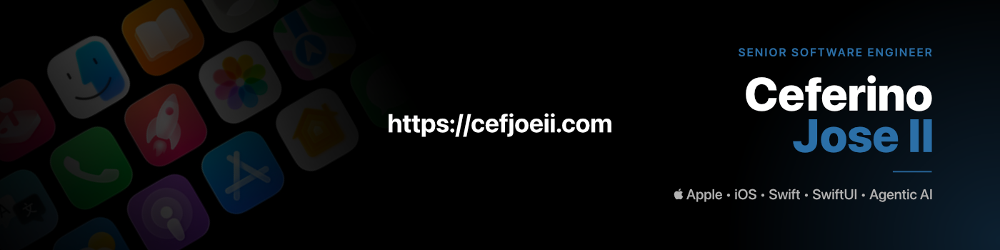

<!--## Hi there 👋

**cefjoeii/cefjoeii** is a ✨ _special_ ✨ repository because its `README.md` (this file) appears on your GitHub profile.

Here are some ideas to get you started:

- 🔭 I’m currently working on ...
- 🌱 I’m currently learning ...
- 👯 I’m looking to collaborate on ...
- 🤔 I’m looking for help with ...
- 💬 Ask me about ...
- 📫 How to reach me: ...
- 😄 Pronouns: ...
- ⚡ Fun fact: ...
-->

Senior Software Engineer with 9+ years of experience collaborating with international clients in the tech industry. Worked effectively and seamlessly with developers and stakeholders from the USA, Norway, Russia, Ukraine, Romania, Australia, China, Hong Kong, India, and the Philippines.

Solving real-world problems by crafting reliable, production-ready native iOS applications in Swift and SwiftUI with a clean, strategic, and organized structure and architecture. Driven to enhance business profitability and elevate user satisfaction through intuitive UI design and smooth user experiences (UX). Leveraging modern tools such as Claude Code, GitHub Copilot, and Codex with Agentic AI to improve efficiency and productivity.

#### Primary Skill Set
- Swift/SwiftUI/iOS

#### Recent Explorations
- AI/Claude Code/GitHub Copilot/Codex

#### Occasional Explorations
- Node.js/Express.js/Nest.js
- HTML/CSS/JavaScript/React.js
- Kotlin/Android
- UI/UX Prototyping/Figma
- Graphic Design/Adobe/Affinity

